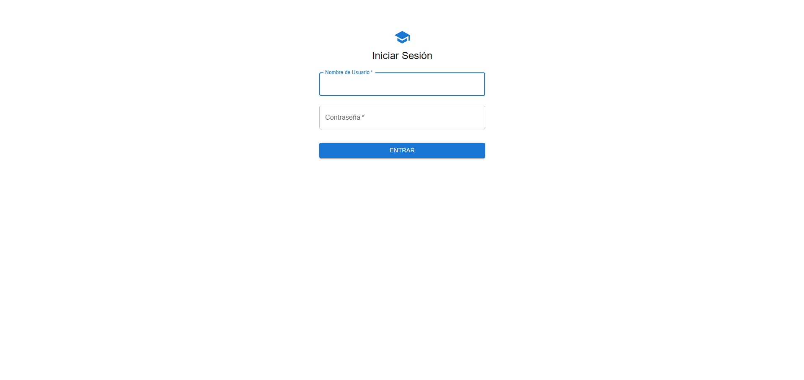
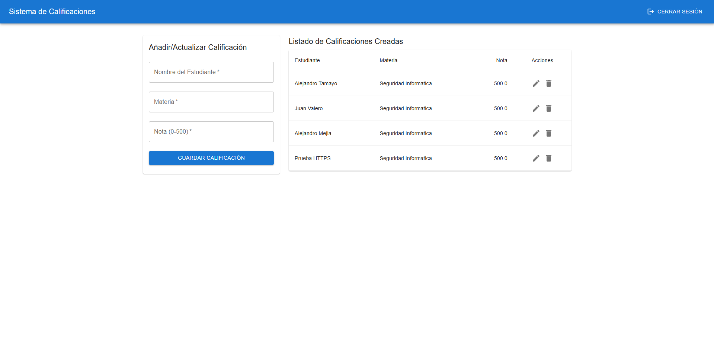

# Sistema de Gestión de Calificaciones

Una aplicación web full-stack segura para la gestión de calificaciones académicas, desarrollada como proyecto final para la materia de Seguridad Informática.

La aplicación fue desplegada en AWS y se puede acceder en vivo en: **[https://mis-calificaciones-app.duckdns.org](https://mis-calificaciones-app.duckdns.org)**

---

## Vistas de la Aplicación

A continuación se presentan las vistas principales de la aplicación.

**Página de Inicio de Sesión**

_Formulario de autenticación para el acceso al sistema._

---

**Dashboard del Profesor**

_Dashboard del profesor, que incluye el formulario para añadir/actualizar notas y el listado de las calificaciones que ha creado._

---

**Dashboard del Estudiante**

_Dashboard del estudiante, que muestra únicamente las calificaciones asociadas a su perfil, sin acceso a funcionalidades de edición._

---

## Arquitectura y Stack Tecnológico

Este proyecto está construido con una arquitectura moderna, desacoplada y contenerizada, enfocada en la seguridad y las buenas prácticas de DevOps.

- **Frontend:** Next.js (React)
- **Backend:** Python con FastAPI
- **Base de Datos:** AWS RDS (MySQL)
- **Contenerización:** Docker y Docker Compose
- **Infraestructura:** AWS EC2
- **Reverse Proxy y SSL:** Nginx con Certbot (Let's Encrypt)

---

## Características de Seguridad Implementadas

- **Autenticación Segura:** Hashing de contraseñas con `bcrypt` y gestión de sesiones mediante **Tokens JWT**.
- **Autorización Basada en Roles (RBAC):** Acceso diferenciado para roles de "profesor" y "estudiante".
- **Endurecimiento del Servidor (Hardening):** Configuración de Nginx con cabeceras de seguridad HTTP (CSP, X-Frame-Options, etc.) para mitigar ataques como XSS y Clickjacking.
- **Comunicación Cifrada:** Todo el tráfico está protegido con **HTTPS**.
- **Aislamiento de Componentes:** Arquitectura dockerizada y base de datos externa en AWS RDS para minimizar la superficie de ataque.
- **Gestión de Secretos:** Todas las credenciales se manejan a través de variables de entorno.

---

## Cómo Ejecutar el Proyecto Localmente

Este proyecto está completamente dockerizado, por lo que su ejecución local es muy sencilla.

**Prerrequisitos:**

- Docker y Docker Compose instalados.

**Pasos:**

1.  Clona el repositorio:
    ```bash
    git clone [URL-de-tu-repo]
    ```
2.  Navega a la raíz del proyecto:
    ```bash
    cd TallerFastApiSeguridad
    ```
3.  Crea un archivo `.env` con tus variables de entorno locales (puedes basarte en el `.env.example` si lo creaste).
4.  Construye y levanta los contenedores:
    ```bash
    docker-compose up -d --build
    ```
5.  Accede a la aplicación en `http://localhost`.
